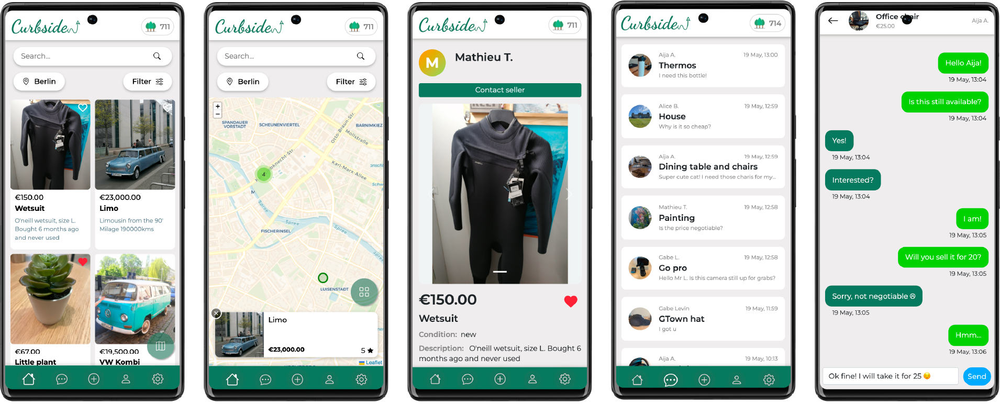
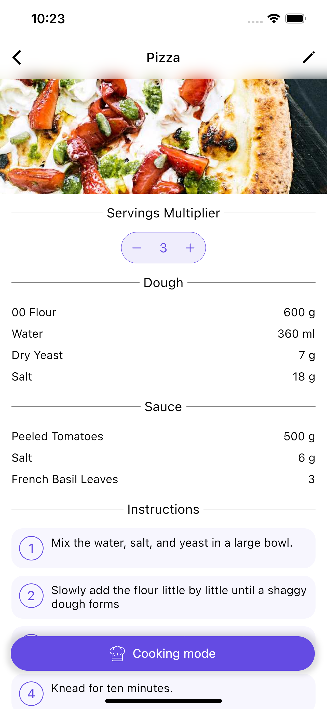
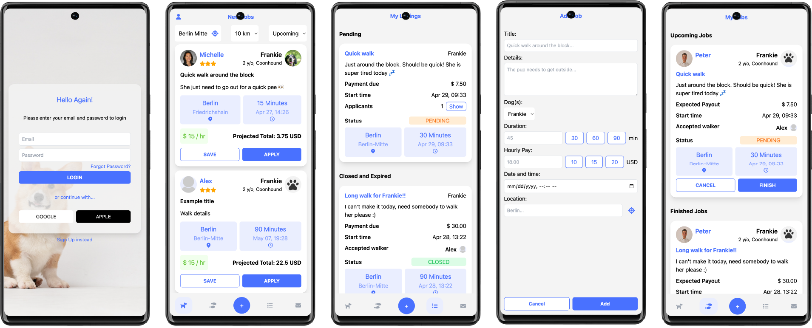
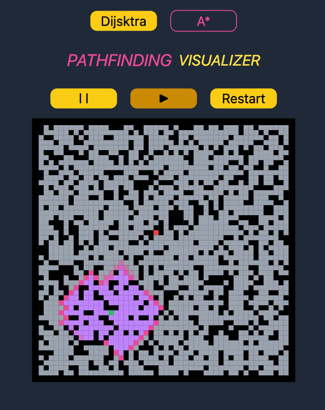

<link rel="stylesheet" href="https://cdn.jsdelivr.net/gh/devicons/devicon@latest/devicon.min.css">

# 🙇 Alex Nussbaumer - Full Stack Developer

Hey! My name is Alex. I am a full stack software engineer from South Tyrol, Italy 🇮🇹. My primary programming languages are TypeScript and Dart. 

After developing serveral apps with **Flutter** and **Dart**, I decided to solidify my programming knowledge through an immersive software engineering program in Berlin, Germany 🇩🇪. Throughout the program, I created multiple apps, including the eco friendly second hand market platform **Curbside** as well as a dog walking app **PupWalk**.

 

## 🤺 Skills

  

 

## 📚 Projects

### [Curbside](https://github.com/CurbsideApp/Curbside) - A Secondhand Marketplace

### [Pocket Chef](https://github.com/alexn62/personal_recipes) - A Smart Recipe Manager

### [PupWalk](https://github.com/alexn62/pup-walk) - A Dog Walking App

### [Dijkstra & A-* Pathfinding Visualizer](https://alexn62.github.io/pathfinding-visualizer/)

